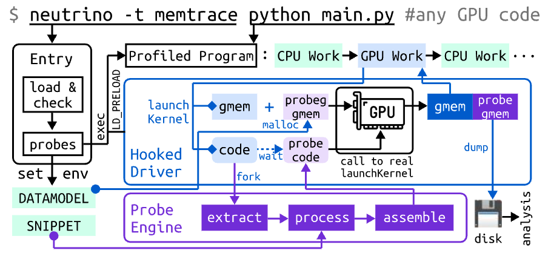

# NEUTRINO: Fine-grained GPU Kernel Profiling via Programmable Probing

This is the development repository of Neutrino, a GPU observability platform based on programmable probing like eBPF for Linux.
The aim of Neutrino is to provide another programmable interface inside GPU Kernel other than AOT/JIT programming to flexibily observe its runtime behavior under black-box environment. 
For observability, Neutrino mainly features:

1. Fine-granularity: `neutrino` directly works on instructions, the lowest software level, to offer the finest granularity that can be effectively mapped to particular hardware units like tensor core.
2. Programmability: `neutrino` extends the programmability of previous instrumentation tools (NvBit, GTPin, HIPAnalyzer) by probe cooperation with registers as temporal storage
3. Versatility: `neutrino` supports both value profiling (capturing register value in runtime like memory address) and value profiling (capture timestamp of operation via reading clock).

Check our demo hosted on Colab:


## Installtion
As the project is still in preview, please install from source via:

```bash
git clone https://github.com/neutrino-gpu/neutrino
cd neutrino && python setup.py install
neutrino --help # test installation and system config
```

Please note `pip install neutrino` will install another old project! We're still working with pip installation.

## Probing Guide

Inspired by [eBPF](https://ebpf.io/what-is-ebpf/), `probe` in Neutrino refers to tiny sandboxed code snippet that could be attached to the GPU kernel at assembly level (PTX, GCNAsm, SPIR-V) in the runtime. 
`probe` extends a new programmable space than traditional AOT/JIT programming and provides a convenient way for observability to black-boxed GPU runtime.

Currently Neutrino probes are written directly in assembly and is organized in [TOML](https://toml.io/en/), like the following example:

```toml
analyze_hook = "block_sched_local.py"

[block_sched]
position = "kernel"
datamodel = "warp:16" # every warp save 16 bytes
before = """.reg .b64 %lstart; // local start time (unit: cycle)
.reg .b64 %lend;    // local end time (unit: cycle)
.reg .b64 %elapsed; // thread elapsed time in u64
.reg .b32 %elapse;  // thread elapsed time in u32
mov.u64 %lstart, %clock64;"""
# following operationo is done only by leader thread
after = """mov.u64 %lend, %clock64;
sub.u64 %elapsed, %lend, %lstart; 
cvt.u32.u64 %elapse, %elapsed; // convert to u32
SAVE.u64 {%lstart}; // store start in u64 for alignment
SAVE.u32 {%elapse, %smid}; // store elapased time and core id"""
```

Every nested dict are treated as a probe, and more than one probe is allowed and welcomed (for cooperation)! For each probe, there're several keyword:
* `name` of probe is implicitly given as name of nested dict, e.g., `block_sched` in this example.
* `position` defines where probe will be inserted, `kernel` means this is a kernel-level probe. You can give any valid instruction as position.
* `datamodel` defines how your data will be dumped, supporting `warp` and `block` with integer as unit in bytes. `warp:16` means every warp will save 16 bytes.
* `before` and `after` defines probe snippet to be inserted before and after position. They're written in assembly that you can operate registers and save profiling results.

We also extends some helper for your convenience:
* `SAVE`: will be replaced by instructions to save results
* `OUT`, `IN1`, `IN2`, `IN3`: will be replaced by register name of operands.

Additionaly, `analyze_hook` is path/to/analyze_script that would be automatically executed after each trace dump for workflow automation.

## Implementation Details and Hacking
`neutrino` is designed to operate in the following workflow:



It's centralized with Hooked Driver (catching GPU request, allocate and save buffer) and Probe Engine (parse and match assembly to attach probe), and they're placed in the following code structure:

```
neutrino
├── build
│   └── process.py # Probe Engine implemented
├── src
│   ├── common.h   # Hooked Driver Defn
│   ├── modified.c # Hooked Driver Impl
│   ├── preload.c  # for LD_PRELOAD
│   ├── parse.py   # Parse Unhooked CUDA ABI
│   ├── unmodified.c # generated by parse.py
│   ├── signature.c  # generated by parse.py
│   ├── sha1.h   # third-parties
│   └── uthash.h # third-parties
```

We welcome every developer hacking probe engine in `neutrino/build/process.py` to extend the functionality of Neutrino. This is implemented in Python with while performance degradation covered by code cache.

Please raise an issue if you want to modify hook driver.

## Compatibility
### Hardware
Currently neutrino only supports NVIDIA GPU with CUDA and our plan on supporting other platform are summarized here:

| Hardware Platform	| Support Status |
| --- | --- |
| NVIDIA/CUDA/PTX	| ✅ Supported | 
| AMD/ROCm/GCNAsm |	🏗️ Working |
| General/OpenCL/SPIR-V	| 🚀 Planning |

### Software
Current software support mainly targets AI/ML workloads, and we are welcome contribution on testing `neutrino` on other frameworks and workloads. Support Matrix are summarized below:

| Software Framework | Status | 
| --- | --- |
| cuBLAS/cuFFT/cuSparse...	| ❌ (no plan for supporting) |
| CUTLASS	| ✅ (with macro in building) |
| PyTorch family (torchvision...) | 	✅ (with manual building) |
| JAX	| 🛠️ (Testing) | 
| Triton	| ✅ (with envariable in runtime) |
| NCCL | 🛠️ (Testing) |

Please check below for more details:

#### cuBLAS/cuDNN

`neutrino` does not support these NVIDIA propietary product for several reason:
1. NVIDIA updates its [EULA](https://docs.nvidia.com/cuda/eula/index.html) on decompile/disassemble these propietary products.
2. These propietary product heavily used [dark apis](https://news.ycombinator.com/item?id=39346108), which is out of the scope.
3. Even observation is made, optimization by developers are impossible as they are closed source.

Unfortunately, some drawbacks from not supporting cuBLAS/cuFFT:
* PyTorch's `nn.Linear` and other matmul / conv operations can not be traced -> consider using `CUTLASS` instead.

#### PyTorch
Support for PyTorch requries manual building to store PTX Assembly in installation (by default, PyTorch use FindCUDA macro of CMake which keeps only SASS):

1. Clone the PyTorch: `git clone --recursive https://github.com/pytorch/pytorch`, add `--branch` to specify branch if need
2. Following the [guide](https://github.com/pytorch/pytorch?tab=readme-ov-file#install-dependencies) to install dependnecies.
3. Query compute capability via `nvidia-smi --query-gpu=compute_cap --format=csv,noheader`
4. Modify the fatbin setting and add NVCC flags in `pytorch/CMakeLists.txt`, see below code block.
5. Follow the [guide](https://github.com/pytorch/pytorch?tab=readme-ov-file#install-pytorch) to build and install PyTorch.

```cmake
# pytorch/CMakeLists.txt, around line 660, comment out next line
# string(APPEND CMAKE_CUDA_FLAGS " -Xfatbin -compress-all")
# add the following two line:
string(APPEND CMAKE_CUDA_FLAGS " -Xfatbin --compress=false")
string(APPEND CMAKE_CUDA_FLAGS " -gencode arch=compute_80,code=compute_80")
```

#### Triton
Triton support requires configuring the `TRITON_CACHE_DIR` environment variable. This can be set to any value such as the current directory via `TRITON_CACHE_DIR=.` in bash or place following snippet at the beginning of your Python script:

```py title="begin of your python code"
import os
os.environ["TRITON_CACHE_DIR"] = "cache"
```

This environment variable is used to instruct Triton to generate and save PTX assembly in GPU executable submitted to driver and catched by `neutrino`.

And if you run into any problem, clear existed Triton build with `rm -rf cache`

#### CUTLASS
Please follow the [guide](https://github.com/NVIDIA/cutlass/blob/main/media/docs/quickstart.md) , but switch on an internal macro `CUTLASS_NVCC_EMBED_PTX` in building via `cmake`:

```bash
cmake -DCUTLASS_NVCC_EMBED_PTX ... # your original command
```

## Citation
All source code are copyright and the project itself currently is anonymous under review.